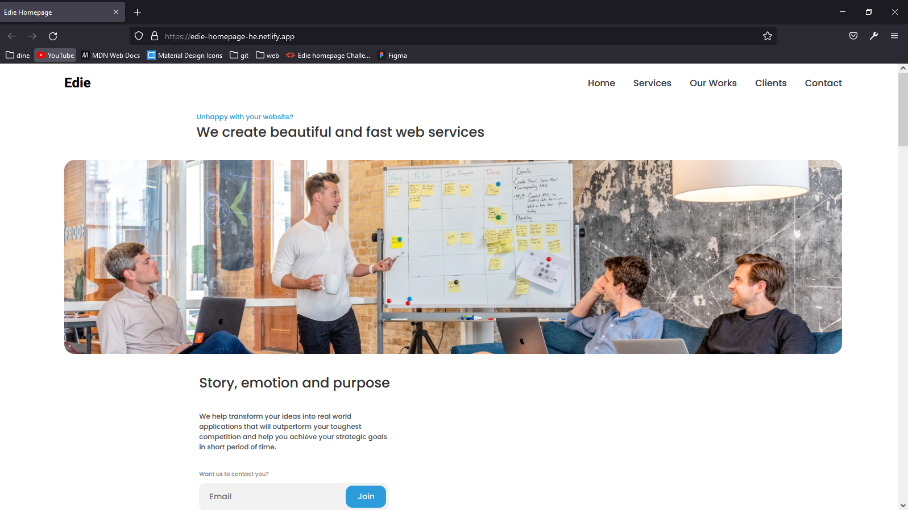

<!-- Please update value in the {}  -->

<h1 align="center">Edie homepage</h1>

   Solution for a challenge from  <a href="http://devchallenges.io" target="_blank">Devchallenges.io</a>.

  <h3>
    <a href="https://edie-homepage-he.netlify.app/">
      Demo
    </a>
     | 
    <a href="https://github.com/houssam-developer/edit-homepage">
      Solution
    </a>
     | 
    <a href="https://devchallenges.io/challenges/xobQBuf8zWWmiYMIAZe0">
      Challenge
    </a>
  </h3>

<!-- TABLE OF CONTENTS -->

## Table of Contents

- [Overview](#overview)
- [Built With](#built-with)
- [Features](#features)
- [How to use](#how-to-use)
- [Contact](#contact)
- [Acknowledgements](#acknowledgements)

<!-- OVERVIEW -->

## Overview

This edie homepage can be found here: "https://edie-homepage-he.netlify.app/".
Thanks to that challenge, I learn to work efficiently in order to succeed.
And I hope to make more beautifuls websites and become an expert in front-end developmemt :)

### Built With

<!-- This section should list any major frameworks that you built your project using. Here are a few examples.-->

- [HTML]
- [CSS]

## Features

<!-- List the features of your application or follow the template. Don't share the figma file here :) -->

This application/site was created as a submission to a [DevChallenges](https://devchallenges.io/challenges) challenge. The [challenge](https://devchallenges.io/challenges/xobQBuf8zWWmiYMIAZe0) was to build an application to complete the given user stories.

Challenge: Create a static page with HTML and CSS following the designs. Don’t look at the existing solution. Fulfill user stories below:

- User story: I can see a page following the given design
- User story: I can see a page on mobile following the given design
- User story: I can go to certain locations by selecting links in navigation or footer

Icon: https://google.github.io/material-design-icons/

## Acknowledgements

<!-- This section should list any articles or add-ons/plugins that helps you to complete the project. This is optional but it will help you in the future. For example -->

- [Steps to replicate a design with only HTML and CSS](https://devchallenges-blogs.web.app/how-to-replicate-design/)
- [Node.js](https://nodejs.org/)
- [Marked - a markdown parser](https://github.com/chjj/marked)

## Contact

- Website [edie-homepage-he.netlify.app](https://edie-homepage-he.netlify.app)
- GitHub [@houssam-developer](https://github.com/houssam-developer/edit-homepage)